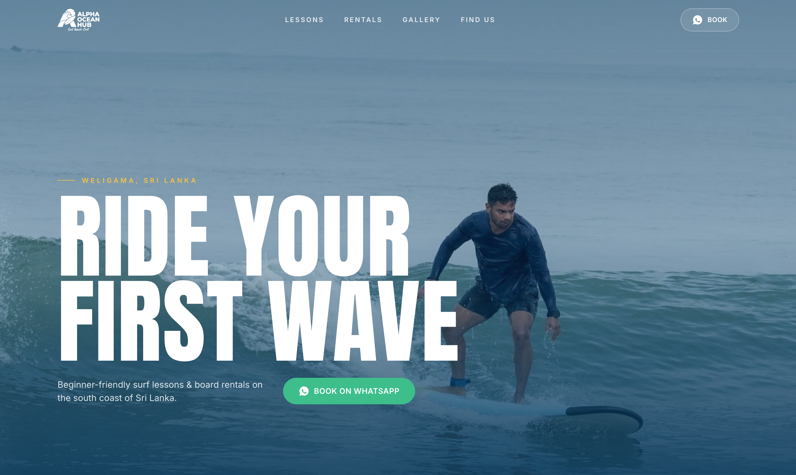
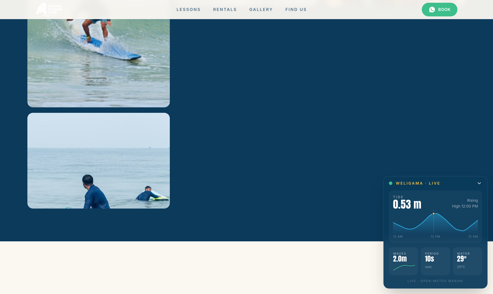
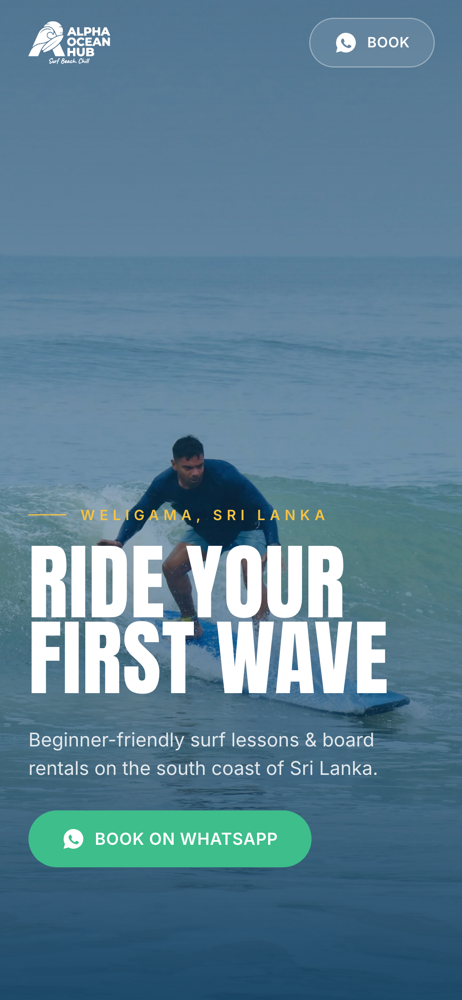
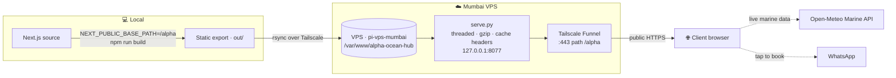
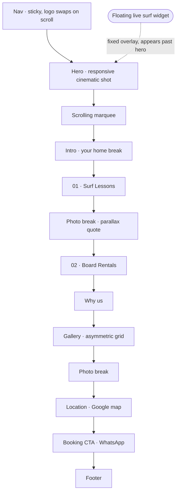
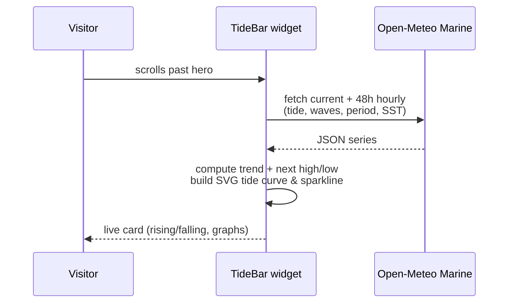

<div align="center">

# 🌊 Alpha Ocean Hub

### Surf school & board rentals — Weligama, South Coast Sri Lanka

A cinematic, single-page marketing site with **live surf & tide data** and
**WhatsApp-only** conversion. Built with Next.js, statically exported, and shipped
to a VPS over Tailscale Funnel.

[**Live demo →**](https://pi-vps-mumbai.tail641fa8.ts.net/alpha/) &nbsp;·&nbsp; [@alphaoceanhub](https://www.instagram.com/alphaoceanhub/)



</div>

---

## ✨ Highlights

- **Cinematic hero** — responsive art direction (landscape on desktop, vertical surf shot on mobile) with a slow Ken-Burns zoom, CSS-driven entrance so the headline never waits on JavaScript.
- **Live surf report** — a floating, scroll-following widget pulling real-time **tide, wave height, swell period & water temperature** for Weligama from the free [Open-Meteo Marine API](https://open-meteo.com/), with hand-drawn SVG tide curves and sparklines.
- **WhatsApp-first** — every call-to-action opens a pre-filled WhatsApp chat. No prices on the page; pricing is handled in conversation.
- **Editorial design** — photography-led layout, condensed display type, smooth scroll (Lenis) and graceful scroll reveals.
- **Fast & resilient** — static export, gzip + immutable caching, lazy images, `<picture>` art direction. Content is visible by default and degrades gracefully without JS.

<div align="center">


</div>

---

## 🧱 Tech stack

| Layer | Choice |
|-------|--------|
| Framework | **Next.js** (App Router, `output: 'export'`) |
| Language | TypeScript + React |
| Styling | Tailwind CSS |
| Motion | Framer Motion + Lenis smooth scroll, CSS keyframes |
| Fonts | Anton (display), Inter (sans), Caveat (script) via `next/font` |
| Live data | Open-Meteo Marine API (no key, CORS-enabled) |
| Hosting | Static files on a VPS, exposed publicly via **Tailscale Funnel** |

---

## 🏗️ Architecture

How a build gets from a laptop to a client's browser:



The site is mounted at the **`/alpha` path** of a shared Funnel host (other sites
live at `/`, `:8443`, `:10000`), so deployment is purely additive — hence the
`basePath` build.

---

## 🗺️ Page structure



---

## 📡 Live surf data flow



---

## 🚀 Local development

```bash
npm install
npm run dev          # http://localhost:3000
npm run test         # vitest (WhatsApp link helper)
npm run build        # static export to out/
```

> Hardcoded asset paths route through `lib/asset.ts`, which prefixes
> `NEXT_PUBLIC_BASE_PATH`. Leave it unset locally (served at root); set it for a
> sub-path deploy.

---

## 📦 Deploy (static export → Tailscale Funnel)

```bash
# 1. Build with the sub-path base
NEXT_PUBLIC_BASE_PATH=/alpha npm run build

# 2. Push to the VPS (files served from the /alpha subdir)
rsync -az --delete out/ root@<vps>:/var/www/alpha-ocean-hub/alpha/

# 3. The systemd service (serve.py) serves it on 127.0.0.1:8077;
#    Tailscale Funnel maps host path /alpha -> that port (strips the prefix).
```

`scripts/vps-serve.py` is the tiny threaded static server (gzip + cache-control)
that runs under systemd on the VPS.

---

## 📁 Project structure

```
app/            App Router pages, layout, globals.css, icon.svg (surfboard favicon)
components/     Hero, TideBar, Gallery, Lessons, Rentals, Nav, Footer, …
lib/            site.ts (config), whatsapp.ts, gallery.ts, asset.ts
public/photos/  optimized surf photography
scripts/        image optimization, webp conversion, vps-serve.py, audit helpers
docs/           design spec, implementation plan, README images
```

---

## ⚙️ Configuration

All business config lives in **`lib/site.ts`** — WhatsApp number, coordinates
(drive the live data), Instagram handle, and the Google Maps embed.

---

<div align="center">
<sub>Surf. Beach. Chill. 🏄</sub>
</div>
